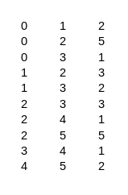
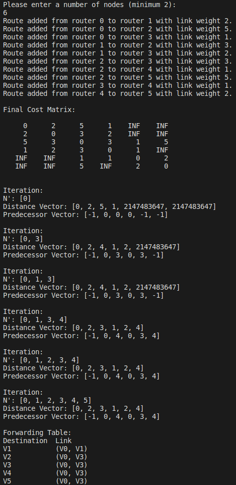

# Overview

Java code for Dijkstra's Algorithm to set up a forwarding table based off of a pre-defined weighted matrix. User can specify how many nodes to include as input to forwarding table.

# Set Up

`topo.txt` file has weights for each edge serving as input into the algorithm.

Each row is an edge, first element is the source router, second element is the destination router, and third element is the weight.

# Output

Matrix creation is printed as each row is added, and the entire matrix is printed once the entire `topo.txt` file has been read.

Every iteration of Dijkstra's Algorithm is printed for legibility.

Finally, the forwarding table is printed.